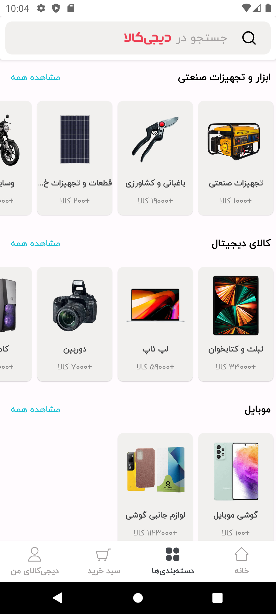
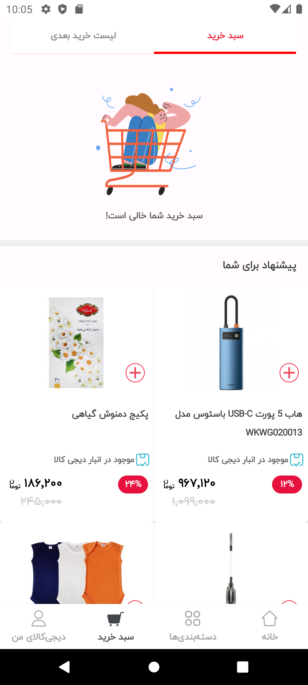

# Digikala Project

This repository contains the source code for the Digikala project, an e-commerce platform developed using Kotlin. The project is designed to provide a comprehensive shopping experience, including features like product listings, search functionality, and user authentication.


## Features

- **Product Listings**: Browse a wide range of products with detailed descriptions and pricing.
- **User Authentication**: Secure login and registration for users.
- **Shopping Cart**: Add products to the cart and manage them.
- **Checkout Process**: Complete purchases with a streamlined checkout process.

## Technologies Used

- **Kotlin**
- **Jetpack Compose**: For building the UI.
- **Data Store**: For data storage.
- **Retrofit**: For network requests.
- **Room**: For local database management.
- **Hilt**: For dependency injection.
- **Flow**: For handling asynchronous data streams.
- **MVVM Architecture**: For maintaining a clear separation between the UI and business logic.

## Screenshots







### Prerequisites

- [Java Development Kit (JDK)](https://www.oracle.com/java/technologies/javase-jdk11-downloads.html) 11 or higher
- [Android Studio](https://developer.android.com/studio)

## Installation

1. Clone the repository to your local machine.
   ```bash
   git clone https://github.com/MahdiRohani/online-food-shop-ui.git
   ```
2. Open the project in Android Studio.
3. Build and run the application on an emulator or physical device.

